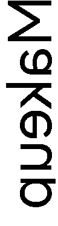

# Supvan E10 / E10pro — print protocol

Reverse-engineered specification and supporting evidence. Captured 2026-07-28
from the vendor Android app; implemented in
`supvan_proto::profile::PrintProfile::ESeries`, which drives the whole series
(E10, E10pro, E11, E12, E16 — see §11).

> **Summary.** The E-series Bluetooth label makers do *not* speak the T50 print
> flow this driver was built around. They use a smaller print buffer, a 96-dot
> printhead, different `PAGE_REG` constants, and one compressed transfer per
> buffer. Driving one with the T50 profile produces a label that feeds normally
> and comes out **completely blank**.

## 1. Device under test

All findings below come from one physical unit. Values are as reported by the
firmware itself via `supvan-cli probe`:

| Property | Value | Source |
|---|---|---|
| Model name | `E10pro` | `RD_DEV_NAME` (0x16) |
| Bluetooth address | `A4:93:40:5D:71:B6` | BlueZ |
| Advertised BT name | `T0143F2408183024` | BlueZ `Name` — firmware serial, not a model name |
| Firmware | `1` | `READ_FWVER` (0x15) |
| Protocol revision | `1.4` | `READ_REV` (0x17) |
| Loaded media | 15 × 50 mm, gap 0, type 0 | `RETURN_MAT` (0x30) |
| Transport | Bluetooth RFCOMM (SPP) only — no USB interface | discovery |

**The advertised BT name is a serial, not a model.** BlueZ reports
`T0143F2408183024`; the marketing name `E10pro` is only reachable on the wire
via `RD_DEV_NAME`. Any discovery that matches on a model-name substring will
miss this device entirely — which is why `device::probe_bt_model_name` queries
it and feeds the result into the `MDL:` field that selects the driver family.

The serial still carries the hardware code (`T0143`), and `bt_patterns` matches
on it, so a unit whose probe was skipped or failed advertises that serial as
its `MDL:` rather than a guessed family name. The probe is deliberately skipped
wherever the name already pins a family, so this is the ordinary path, not a
fallback for failures.

## 2. How the evidence was obtained

The vendor Android app prints to this unit correctly, so its Bluetooth traffic
is ground truth. Method:

1. Android Developer options → *Bluetooth HCI snoop log* → **Enabled** (not
   "Filtered" — the filter strips ACL payloads and leaves only ≤16-byte
   headers).
2. *Bluetooth HCI snoop log filters* → all disabled.
3. Toggle Bluetooth off and on. **Required:** the snoop mode is latched when
   the Bluetooth stack starts, so changing it while the stack is running has no
   effect (`sSnoopLogSettingAtEnable = EMPTY` in the bugreport).
4. Print one 15 × 50 mm label reading "MaKenBo".
5. `adb bugreport` → extract `FS/data/misc/bluetooth/logs/btsnoop_hci.log`.
6. Decode with [`scripts/btsnoop_supvan.py`](../scripts/btsnoop_supvan.py):
   btsnoop → HCI ACL → L2CAP reassembly → RFCOMM UIH → Supvan framing → LZMA →
   print buffers.

The resulting capture contained 1413 ACL records over a 152-second window, of
which 468 L2CAP PDUs were host→printer.

**The raw capture is deliberately not committed.** A full HCI snoop log records
*all* Bluetooth activity on the phone, not just the printer, so it may contain
unrelated personal traffic. Re-capture locally with the recipe above rather
than expecting the log in this repository.

## 3. Confirmed compatible

These parts of the existing `supvan-proto` implementation were verified
byte-for-byte against the capture and needed **no change**. Recording them
matters as much as the differences: it bounds the problem.

| Area | Evidence | Status |
|---|---|---|
| Command frame layout | Our `INQUIRY_STA` and the vendor's are identical: `7e5a0c001001aa1101000001000000` | identical |
| Data packet framing | 506-byte `AA BB` packets inside 512-byte `7E 5A … 10 02` frames, 500 payload bytes each | identical |
| LZMA parameters | Stream header `5d 00 20 00 00 a0 0f 00 00 00 00 00 00` → props `0x5D` (lc=3, lp=0, pb=2), dict 8192, definite uncompressed size 4000 | identical |
| Print-buffer checksum | `sum(buf[2..14])` plus the byte before each 256-byte stride. Our algorithm reproduces both captured checksums exactly: `0x05ed` and `0x0053` | identical |
| Bitmap encoding | Column-major, LSB-first within each byte, mirrored across the head — decoded cleanly into readable text (§7) | identical |
| `START_PRINT` parameter | `7e5a0c001001aa1301000001000000` → param field = `0` | identical |
| `NEXT_ZIPPEDBULK` block size | Vendor sends a literal `512`, which is what our SPP framing has always carried (`SppCodec::send_bulk_header`); it is a property of the transport, not the model | identical |

**On the `START_PRINT` parameter.** The vendor app's JavaScript contains
`getSPMaterialTypeCode()` mapping paper types to 1/2/3, which suggests
`START_PRINT` carries a material class. The capture shows this device receives
**0**. Those codes belong to the USB/SP flow for other model families. Sending
1, 2 or 3 was tested on hardware and printed blank in every case, so the
parameter stays hardcoded at 0.

## 4. Differences — the specification

Every row below was wrong in the T50-derived implementation. Together they
explain the blank output.

### 4.1 Geometry

| Field | E-series | T50 family | Evidence |
|---|--:|--:|---|
| `per_line_byte` | 12 | 48 | buffer header byte [6]; 12 bytes = **96-dot printhead** |
| print buffer size | 4000 | 4096 | LZMA header declares uncompressed length 4000 |
| max columns per buffer | 332 | 84 | (4000 − 14) / 12 = 332; matches the captured split |
| `margin_top` / `margin_bottom` | 1 / 1 | 8 / 8 | header bytes [8..12] |

The printhead is **96 dots**. At 203 dpi that is a 12 mm print width on 15 mm
tape, and the captured 373-column page is 46.6 mm of the 50 mm label —
self-consistent.

**Confidence.** The 96-dot width is *measured* (`per_line_byte = 12`). The 203
dpi figure is *inferred* from that width being a plausible print area on 15 mm
tape; no command in the capture reports resolution directly. If a future
capture contradicts it, the dpi is the value to revisit, not the dot count.

#### 4.1.1 The printable area is narrower than the stock

A direct consequence of the 96-dot head, and the one most likely to bite a
caller: **this printer inks 12 mm of 15 mm tape**. The 1.5 mm on each edge is
physically unreachable. The vendor app sidesteps the issue by rendering its
canvas at exactly 96 dots, so a page wider than the head never exists.

Anything driving the printer through CUPS does not have that luxury: the media
size comes from the RFID tag (15 × 50 mm), so CUPS renders a **120-dot** page
and 24 dots have to go somewhere. `center_in_printhead()` crops them — half
from each edge. Two practical consequences:

- Designs must keep their content inside the middle 12 mm. Layout that reaches
  the full label width loses 1.5 mm per side; on a multi-line label that is
  enough to slice off the outer line.
- The crop is *symmetric*. An earlier implementation copied the leading bytes
  instead, dropping all 24 dots off a single edge — visible as one line
  vanishing entirely rather than every line narrowing. Regression-tested by
  `oversized_input_is_cropped_symmetrically`.

The cleaner fix would be to advertise `media-left-margin-supported` /
`media-right-margin-supported` so CUPS renders 12 mm and no crop ever happens.
That is not currently possible: `ipp-printer-app` hardcodes all four hard
margins to zero — reasonable for the rest of the range, which does print edge
to edge — and `PrinterConfig` exposes no margin fields. It needs a change in
that crate.

#### 4.1.2 Label length is not quantised by the stock list

The E-series runs *continuous* tape. There is no die-cut gap to register
against, and `RETURN_MAT` reports the roll's *width* only — no length. The
printed length is therefore just the column count the driver ships (minus the
1 + 1 margin columns), and nothing in the protocol enforces a minimum or a
multiple of any advertised stock size. A 5 mm page advances 5 mm of tape; a
400 mm page advances 400 mm.

The constraint is entirely CUPS-side, and it is sharper than it looks:

- The **job's media attribute** sets the raster height, not the document. A
  15 × 37 mm PostScript page submitted with `media=om_15x40mm_15x40mm` arrives
  as 320 columns — 40 mm — with the document placed inside it.
  `setpagedevice` in the document is ignored.
- Requesting a size that is *not* in the generated PPD does not fall back
  gracefully: cups-filters' `universal` filter **crashes on signal 11** and the
  job dies with "Filter failed". Callers must only ask for enumerated sizes.
- Enumerated sizes must be at least **2 mm apart**. At 1 mm spacing CUPS
  resolves the request to something a millimetre short — asking for
  `om_15x20mm` delivered a 152-column raster instead of 160 — which silently
  clips the trailing edge. At 2 mm every rung arrives at its nominal size
  (above ~60 mm it loses a single dot to 203 dpi rounding, which is harmless).
- CUPS truncates the PPD it generates somewhere past ~470 sizes: 999 advertised
  produced 410, with the last contiguous rung at 471. An over-long list would
  therefore advertise lengths that crash the filter when a client picks one.
  The cap counts *advertised sizes*, not rungs: the ladder repeats every rung
  once per width in `media_ladder.widths`, so the budget a band is checked
  against is `400 / widths.len()` lengths.

So the length a caller can obtain is whatever `media_mm` and `media_ladder` in
`data/models.toml` enumerate. That is why the E-series family carries a ladder
of lengths that are not real stock sizes: they are not stock, they are the
lengths a caller is allowed to request. Both limits are enforced at load time
by `models::load()` so a bad table fails loudly instead of at print time.

**Future optimization.** The enumeration is a ladder, so a label that needs
37 mm has to round up to the next rung and waste the difference. Advertising
`media-size-supported` with *rangeOfInteger* `x-dimension`/`y-dimension`
instead of a set of fixed collections would make CUPS emit `*CustomPageSize`,
and a caller could then ask for the exact length (`-o media=Custom.15x37mm`)
and dispense tape to the millimetre with no ladder at all. Blocked on the same
crate as the margin fix above: `ipp-printer-app` 0.8 emits enumerated sizes
only. Not attempted here.

### 4.2 PAGE_REG and density

| Field | E-series | T50 family | Note |
|---|--:|--:|---|
| `mat` (bits 6–7 of byte 3) | 0 | 1 | was hardcoded to 1 |
| `nodu` (bits 2–5 of byte 3) | 4 | = density | constant, independent of density |
| density byte [12] | 19 | ≤ 15 | 19 exceeds the T-series cap, which silently clamped it |
| density on continuation buffers | 0 | = density | only the leading buffer carries it |

### 4.3 Transfer flow

| Field | E-series | T50 family |
|---|---|---|
| compression unit | one LZMA stream **per buffer** | one stream for the whole page |
| `BUF_FULL` parameters | `(0, 0)` | `(compressed_len, speed)` |
| vendor commands | `0xC9` and `0xBA` bracket `START_PRINT` | none |

## 5. Print handshake

Reconstructed from the capture, with observed inter-frame delays. TX is
phone→printer.

```
TX  INQUIRY_STA      param=0
TX  0xC9             param=110        ← undocumented, immediately before START_PRINT
TX  START_PRINT      param=0
RX  START_PRINT                       +6ms
TX  INQUIRY_STA      param=0
TX  0xBA             param=29         ← undocumented, before any data
RX  0xBA                              +7ms
TX  INQUIRY_STA      param=0
TX  NEXT_ZIPPEDBULK  param=512 count=2
RX  NEXT_ZIPPEDBULK                   +69ms
TX  DATA  (packet 1/2)
TX  DATA  (packet 2/2)                ← buffer 1: 332 cols, page_st
RX  0xBB                              +205ms  (transfer ack)
TX  BUF_FULL         param=0 count=0
TX  INQUIRY_STA      param=0
TX  NEXT_ZIPPEDBULK  param=512 count=2
TX  DATA  (packet 1/2)
TX  DATA  (packet 2/2)                ← buffer 2: 41 cols, page_end + prt_end
TX  BUF_FULL         param=0 count=0
TX  INQUIRY_STA      …                (poll until not printing / not busy)
```

Captured command frames, verbatim:

| Command | Bytes on the wire | Decoded |
|---|---|---|
| `0xC9` | `7e5a0c001001aac96f0000016e000000` | param = 110 |
| `START_PRINT` | `7e5a0c001001aa130100000100000000` | param = 0 |
| `0xBA` | `7e5a0c001001aaba1e0000011d000000` | param = 29 |
| `NEXT_ZIPPEDBULK` | `7e5a0c001001aa5c0500000100020200` | block=512, count=2 |
| `BUF_FULL` | `7e5a0c001001aa1001000001000000 00` | param=0, count=0 |

Frame layout, for reading the hex above: `7E 5A` magic · `len16` · `10 01`
proto/version · `AA` marker · `cmd` · `chk16` (sum of bytes 10–15) · `00 01` ·
`param16` · `count16`. Note the field at offset 8 is a *checksum*, not the
parameter — misreading it as the parameter is what initially suggested
`START_PRINT` carried a material code.

## 6. Print buffer format

Both captured buffers, header bytes verbatim:

```
buffer 0  ed05 0210 4c01 0c 00 0100 0100 13 00   (4000 bytes total)
buffer 1  5300 0c10 2900 0c 00 0100 0100 00 00   (4000 bytes total)
```

| Offset | Field | Buffer 0 | Buffer 1 |
|---|---|--:|--:|
| [0..2] | checksum | 0x05ED | 0x0053 |
| [2..4] | PAGE_REG | 0x1002 | 0x100C |
| [4..6] | columns | 332 | 41 |
| [6] | per_line_byte | 12 | 12 |
| [8..12] | margins | 1, 1 | 1, 1 |
| [12] | density | 19 | 0 |
| [14..] | image data | 3984 bytes | 492 bytes, zero-padded |

Decoding `PAGE_REG`:

- **Buffer 0** `0x1002` → `page_st=1`, `page_end=0`, `prt_end=0`, `nodu=4`,
  `mat=0`
- **Buffer 1** `0x100C` → `page_st=0`, `page_end=1`, `prt_end=1`, `nodu=4`,
  `mat=0`

The page was 373 columns and split 332 + 41 — exactly the `(4000 − 14) / 12 =
332` cap. The buffer is a fixed 4000 bytes and zero-padded, not sized to
content. This split is pinned by the `e10_split_matches_captured_vendor_page`
unit test.

## 7. Decoded bitmap

Decompressing both buffers and reading the image area as 96-dot column-major,
LSB-first data reproduces the label the vendor app printed. This is the single
strongest confirmation that the geometry interpretation is correct — a wrong
`per_line_byte` or bit order yields noise, not legible text.



*96 dots wide × 373 columns, decoded from the captured LZMA payload. Mirrored
across the head, as the driver's own dither stage also emits.*

## 8. Status register: `ribbon_end` is not fatal

Status responses captured *during the vendor app's successful print*:

```
7e5a1600100355113b010000000000 04   MSTA-low = 0x00
7e5a1600100355115c010000000020 04   MSTA-low = 0x20  ← ribbon_end asserted
```

Bit `0x20` of MSTA-low is documented as `ribbon_end` ("色带用完" in the vendor
app). The driver treated it as a hard error, so every job was held with
`media-needed` and retried forever. The capture shows the vendor app printing
successfully with that same bit set.

On this profile the bit must be ignored for print decisions, so
`PrinterStatus::has_error()` and `error_description()` both take the profile
and drop the bit on the E-series. The description is filtered the same way, so
the ignored bit can't be reported as the cause of an unrelated fault.

The observed behaviour is consistent with a ribbon-spool rotation sensor: the
flag appears after a print cycle and clears on power-cycle. It was
independently confirmed to be spurious — the same ribbon prints correctly from
the vendor app.

## 9. Observed but not implemented

Printing works without these; they are recorded so a future investigation does
not have to rediscover them.

| Command | Observed | Guess |
|---|---|---|
| `0x18` | issued after every `RETURN_MAT` | unknown |
| `0xD0` | bulk start, followed by one 500-byte *non-LZMA* blob, at connect | RFID / material handshake |
| `0xB0` | payload is ASCII `"20260729"` | sets the current date |
| `0xC9` / `0xBA` | params 110 / 29, invariant across both pages | implemented as constants; meaning unknown |

To identify `0xC9` and `0xBA`, capture a second label of a *different size* and
see which parameter tracks the geometry.

## 10. Verification

### Automated

- `e10_split_matches_captured_vendor_page` — reproduces the exact 332 + 41
  column split, 4000-byte buffers, margins 1/1, `nodu=4`, `mat=0`, density on
  the first buffer only.
- `e10_density_is_not_clamped_to_the_t_series_maximum` — density 19 survives on
  E10 and still clamps to 15 on the T-series.
- `oversized_input_is_cropped_symmetrically` — a page wider than the head loses
  the same number of dots from both edges (§4.1.1).
- `ribbon_end_alone_does_not_block_the_e_series` — §8, including that the
  ignored bit stays out of the failure message.
- `test_pattern_buffer_regions_match_the_real_split` — the diagnostic pattern
  draws buffer boundaries where `split_into_buffers` actually puts them.
- The existing `tests/pipeline.rs` byte-level fixtures continue to pass
  unchanged, confirming the T50 path is untouched.

### On hardware

- `supvan-cli test-print` — profile auto-detected from `RD_DEV_NAME`, two
  buffers, pattern printed correctly.
- CUPS/IPP job — `profile=ESeries, printhead=96`, "hello world" printed correctly
  on 15 × 50 mm stock.
- Multi-line label constrained to the 12 mm printable area — all lines reach
  the printhead buffer intact (§4.1.1).

## 11. Applicability to other E-series models

Only the **E10 / E10pro** is captured, but the whole series — **E11, E12 and
E16** — is mapped to the `supvan_e` family and therefore to this print flow.
The alternative is the T50 flow, which is known to feed the tape and print a
blank label on this class of device, so the captured flow is strictly the
better guess.

The flow-level constants (4000-byte buffers, `mat=0`, `nodu=4`, per-buffer
transfer, `BUF_FULL(0,0)`) are expected to be shared across the E-series.

`printhead_dots` is the one value that does **not** transfer cleanly: 96 was
measured from this unit's `per_line_byte`, and a model on wider tape will have
more. The two directions are not symmetric, which is why one family can cover
the series safely:

- **Under-declaring** (an E16 driven at 96 dots) prints a correct label in a
  narrower band than the tape allows. Wasteful, not broken.
- **Over-declaring** hands the firmware a `per_line_byte` its head cannot
  accept, and fails in the same silent, blank-label way as the wrong flow.

So 96 is the safe floor for the series. Confirming a wider model needs one
capture — read `per_line_byte` out of a single print buffer with
`scripts/btsnoop_supvan.py` — after which it wants its own `[[families]]`
entry with the measured `printhead_dots`, still on `profile = "e-series"`.

## 12. Reproducing

```sh
python3 scripts/btsnoop_supvan.py btsnoop_hci.log
```

Prints every Supvan frame with decoded parameters per direction, then
decompresses the bulk payload and dumps each print buffer's header fields. The
decoder implements btsnoop parsing, ACL→L2CAP reassembly, RFCOMM UIH extraction
and the Supvan framing itself, with no external dependencies.

---

Sources: HCI snoop capture of the vendor Android app (2026-07-28);
`key-functions.js`, recovered from the vendor app bundle; direct hardware
testing against an E10pro. Implementation:
[`crates/supvan-proto/src/profile.rs`](../crates/supvan-proto/src/profile.rs).
See also [PROTOCOL.md](PROTOCOL.md).
